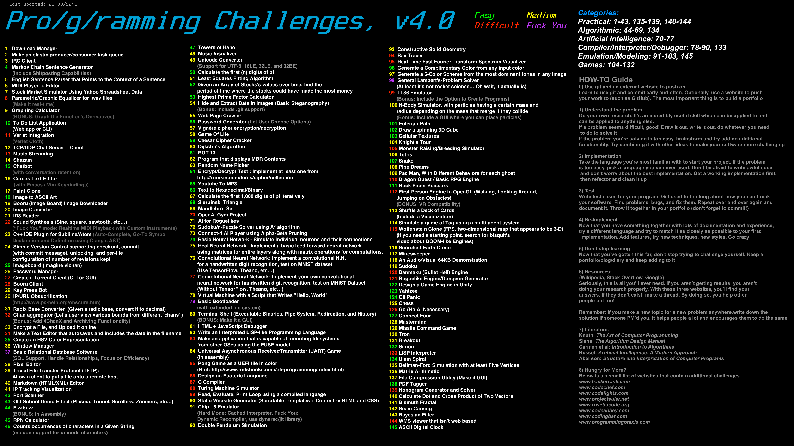

# Programming Challenges

Done - 38, 46, 52, 53, 56, 57, 58, 59, 61, 63, 66, 111, 127
WIP - 116, 47

NOTE: 47 isn't in DONE because the python is from wikipedia. I hope to recreate it myself but I refuse to plagiarize
      43 has two solutions. The python one is recursive and, in my opinion, more elegant